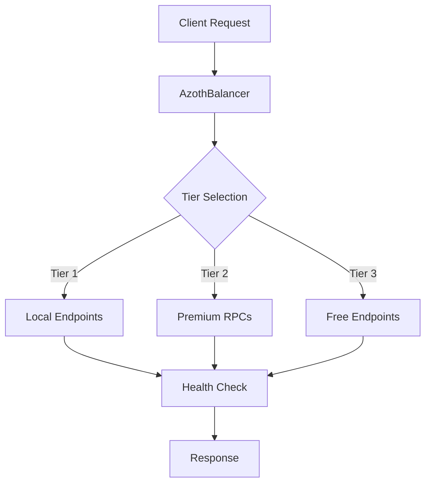

# AzothBalancer - Resilient RPC Infrastructure for Decentralized Solvers

[](https://www.rust-lang.org/)
[](https://github.com/AzothSolver/azoth-balancer/blob/main/LICENSE-MIT)
[](https://github.com/AzothSolver/azoth-balancer)

<p align="center">

</p>

**AzothBalancer** is a high-performance, transport-agnostic JSON-RPC load balancer in Rust. It provides reliability, performance, and cost-efficiency for blockchain infrastructure, focusing on the demanding workloads of CoW Protocol solvers. The project is currently stable at **v0.3.0** with a well-tested foundation.

---

## Core Functionality

* **3-Tier Endpoint Routing:** Prioritizes requests based on configurable weights (Tier 1 ≥100 → Tier 3 1–49)
* **Health Monitoring & Failover:** Automatic cooldown for failing or rate-limited endpoints
* **Per-Endpoint Rate Limiting:** Supports burstable limits to prevent provider throttling
* **Batch Request Handling:** Handles JSON-RPC batch requests safely
* **Hot Configuration Reloading:** `/reload` endpoint updates endpoints without downtime
* **Prometheus Metrics:** `/metrics` exposes health and performance stats
* **Graceful Shutdown:** Completes in-flight requests before termination

---

## Planned Enhancements

* **transaction-type aware routing:** Route sensitive RPC methods (e.g., `eth_sendRawTransaction`) to secure endpoints (eg. MEV Blocker)
* **Response Caching:** Cache common RPC calls (`eth_call`, `eth_getLogs`) to reduce latency
* **Enhanced Security:** HTTPS/TLS termination and optional API key authentication
* **Production Dashboards:** Grafana dashboards for monitoring performance and health

---

## Ecosystem Impact

* **Increase Solver Reliability:** Reduce infrastructure-related settlement failures
* **Lower Operational Costs:** Optimized routing for premium and free endpoints
* **Lower Barrier to Entry:** Enable new solver operators to run reliable infrastructure easily
* **Open-Source Contribution:** Reusable component for CoW ecosystem solvers

---

## Architecture Highlights

* **Async Rust:** Built with Tokio, Axum, Reqwest for performance and correctness
* **Tiered Fallback Strategy:** Strict priority order with Tier 1 → Tier 3 fallback
* **Exponential Backoff:** Progressive cooldown for repeatedly failing endpoints
* **Thread-Safe State:** `Arc<RwLock<...>>` ensures correctness under high concurrency
* **Comprehensive Tests:** 20+ unit tests covering routing, configuration, and error handling

---

## Diagram



---

## Quick Start

---

### Installation via Cargo

```bash
cargo install azoth-balancer
```

After installing, copy the example config:

```bash
curl -O https://raw.githubusercontent.com/AzothSolver/azoth-balancer/main/example.config.toml
```

Then run:

```bash
azoth-balancer --config example.config.toml
```

> Allows you to try AzothBalancer without cloning the repo or building manually.

---

### Installation via Clone & Build

```bash
git clone https://github.com/AzothSolver/azoth-balancer.git
cd azoth-balancer
cp example.config.toml config.toml # Then edit your config
cargo build --release
./target/release/azoth-balancer --config config.toml
```

Default server: `0.0.0.0:8549`

---

### Download Prebuilt Binary

```bash
curl -LO https://github.com/AzothSolver/azoth-balancer/releases/download/v0.3.0/azoth-balancer-v0.3.0-x86_64-unknown-linux-gnu.tar.gz
tar -xzvf azoth-balancer-v0.3.0-x86_64-unknown-linux-gnu.tar.gz
./azoth-balancer --config example.config.toml
```

> Allows you to try AzothBalancer immediately without building or installing via Cargo.

---

## CLI & Multiple Configs

* **Custom Config Path:** Specify a configuration file:

```bash
./target/release/azoth-balancer --config config.toml
# or
cargo run --release -- --config config.toml
```

* **Chain-Specific Configs:** Maintain separate configs for different networks:

```text
config-eth.toml       # Ethereum RPC endpoints
config-arbitrum.toml  # Arbitrum RPC endpoints
config-solana.toml    # Solana RPC endpoints
```

* Start with a specific network config:

```bash
./target/release/azoth-balancer --config config-arbitrum.toml
```

> Note: Each config must contain RPC endpoints from the same chain.

---

## Docker

* Dockerfile included
* `docker-compose.yml` available:

```bash
docker-compose up --build
```

---

## Monitoring with Prometheus & Grafana

AzothBalancer exposes comprehensive metrics at the `/metrics` endpoint. Here's how to set up monitoring:

### 1. Prometheus Configuration

Add this job to your `prometheus.yml`:

```yaml
scrape_configs:
  - job_name: "azoth-balancer"
    static_configs:
      - targets: ["127.0.0.1:8549"]  # Adjust host/port if different
    metrics_path: /metrics
    scrape_interval: 15s
    scrape_timeout: 10s
```

### 2. Grafana Dashboard Import

1. Download the dashboard JSON:
```bash
curl -O https://raw.githubusercontent.com/AzothSolver/azoth-balancer/main/grafana-dashboards/azoth-balancer-monitoring-dashboard-beta.json
```

2. In Grafana:
   - Navigate to **Create → Import**
   - Upload the JSON file or paste the contents
   - Select your Prometheus datasource
   - Click **Import**

### 3. Quick Start with Docker Compose (Optional)

Create `docker-compose.monitoring.yml`:

```yaml
version: "3.8"

services:
  azoth-balancer:
    build: .
    ports:
      - "8549:8549"
    volumes:
      - ./config.toml:/app/config.toml
    restart: unless-stopped

  prometheus:
    image: prom/prometheus:latest
    ports:
      - "9090:9090"
    volumes:
      - ./prometheus.yml:/etc/prometheus/prometheus.yml
      - prometheus_data:/prometheus
    command:
      - '--config.file=/etc/prometheus/prometheus.yml'
      - '--storage.tsdb.path=/prometheus'
      - '--web.console.libraries=/etc/prometheus/console_libraries'
      - '--web.console.templates=/etc/prometheus/consoles'
      - '--storage.tsdb.retention.time=200h'
      - '--web.enable-lifecycle'
    restart: unless-stopped

  grafana:
    image: grafana/grafana:latest
    ports:
      - "3000:3000"
    environment:
      - GF_SECURITY_ADMIN_USER=admin
      - GF_SECURITY_ADMIN_PASSWORD=admin
      - GF_USERS_ALLOW_SIGN_UP=false
    volumes:
      - grafana_data:/var/lib/grafana
      - ./grafana-dashboards:/etc/grafana/provisioning/dashboards
    restart: unless-stopped
    depends_on:
      - prometheus

volumes:
  prometheus_data:
  grafana_data:
```

And `prometheus.yml`:

```yaml
global:
  scrape_interval: 15s

scrape_configs:
  - job_name: "azoth-balancer"
    static_configs:
      - targets: ["azoth-balancer:8549"]
    metrics_path: /metrics
```

Run with:
```bash
docker-compose -f docker-compose.monitoring.yml up -d
```

- **Grafana**: http://localhost:3000 (admin/admin)
- **Prometheus**: http://localhost:9090

### Available Metrics

The dashboard provides:
- **Real-time RPS & error rates**
- **Endpoint health & latency distributions**
- **Rate limiting & cooldown events**
- **Priority-based routing analytics**
- **Concurrency & batch size monitoring**

The dashboard automatically detects your endpoints and provides tier-based analytics for optimal performance monitoring.

---

## License

**MIT or Apache 2.0**

* [LICENSE-MIT](LICENSE-MIT)
* [LICENSE-APACHE](LICENSE-APACHE)

---

## Repository

* GitHub: [AzothBalancer](https://github.com/AzothSolver/azoth-balancer)

## Contact

For questions, suggestions, or contributions, please open an issue on [GitHub Issues](https://github.com/AzothSolver/azoth-balancer/issues).

